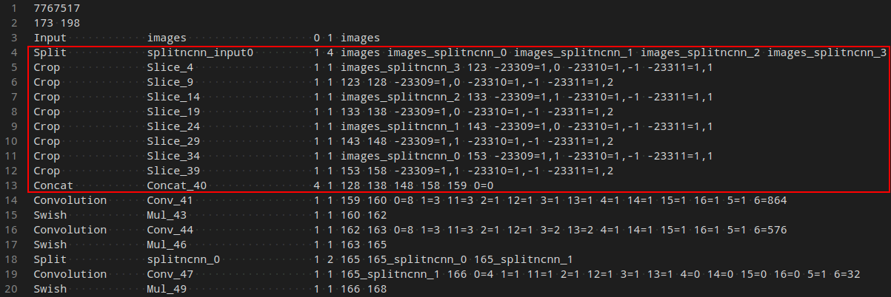

安卓广告跳过 yolov5 ncnn方式集成 
----
代码原地址： https://github.com/nihui/ncnn-android-yolov5  
我在这里只是替换了模型信息，其余的内容基本没有修改。  
原工程并没有写如何进行模型转换，模型转换可以参考这篇文章：https://blog.csdn.net/flyfish1986/article/details/116604907里面写的比较详细了。   
这里简单的做个备份，不想跳转的可以直接参考下面的内容：  
###模型转换为ncnn格式  
>1. 导出onnx  
```bash
python models/export.py --weights yolov5s.pt --img 320 --batch 1
```
>2. onnx-simplifer简化模型
```bash
python -m onnxsim yolov5s.onnx yolov5s-sim.onnx
``` 
>2. 专函为ncnn
```bash
./onnx2ncnn yolov5s-sim.onnx yolov5s.param yolov5s.bin
```
>4. 处理转ncnn产生的Unsupported slice step !  
> 1).处理YOLOv5的Focus模块,将多个slice节点转换为一个focus节点  
>   
> 转换为：  
>   
> 编辑yolov5s.param文件，处理步骤如下：  
> a.  红框内4行到13行删除  
>   
> b.  一共删除了10层，第二行的173更改为164，计算方法173-(10-1)=164  
>    
> c. 增加自定义层  
> ```yaml
YoloV5Focus              focus                    1 1  images 159
> ```  
> 159来自下图，找到删除的第13行  
>   
> Foucs更改之后的结果是  
>   
> 2). 支持动态尺寸输入  
> 将reshape中的960，240，60更改为-1，或者其他 0=后面的数  
>   
> 5. ncnn optimize优化  
> ```bash
./ncnnoptimize yolov5s.param yolov5s.bin yolov5s-opt.param yolov5s-opt.bin 1
>```
>6. C++代码处理  
>1). 三个extract  
>ncnn-20210507/examples目录下的yolov5.cpp,我们仿照代码中output,781,801 进行更改 .代码举例  
>  
>代码更改依据以781,801 为例  
>  
>  
>我们自己的C++代码可以依据onnx文件更改三个输出.也可以根据ncnn的Permute的每一个output,分别是output,395,415  
>  
>2) 代码中anchor  
>a. 可以依据模型在训练时的输出  
>  
>b. 也可以依据yolov5/models/中的配置文件,以yolov5s.yaml为例  
>  
>  
>[_这两种方式我没看明白是怎么得到stride中的那几个数字的，谁知道怎么算的还望不吝赐教。_] 
> 7. 最后的运行  
> 加载模型更改为自己的模型yolov5s-opt.param 和yolov5s-opt.bin  
>   
> 编译： 
> ```bash
 ncnn-20210507/build$ make install
```
>   
> 编译运行：  
> ```bash
 ncnn-20210507/build/examples$ ./yolov5 1.jpg
> ```

### 安卓工程项目集成  
>### step1
>https://github.com/Tencent/ncnn/releases

>download ncnn-android-vulkan.zip or build ncnn for android yourself

>### step2
>extract ncnn-android-vulkan.zip into app/src/main/jni or change >the ncnn_DIR path to yours in app/src/main/jni/CMakeLists.txt

>### step3
>open this project with Android Studio, build it and enjoy!  

  

参考链接：  
https://github.com/cmdbug/YOLOv5_NCNN.git  
https://blog.csdn.net/flyfish1986/article/details/116604907  
https://zhuanlan.zhihu.com/p/266130778  
https://zhuanlan.zhihu.com/p/350278710  